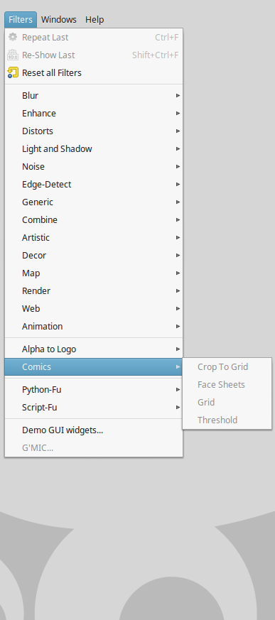

# gimp-comics
Python scripts/plugins for making comics with The Gimp

## Installation
Put scripts into {gimp-config-home}}/plugins
Restart Gimp

On Linux, gimp config home is usually ~/.gimp-2.8

## Quick Demo

## Troubleshooting
Please note, I've had good experience using these on Linux. Running on a Mac is very hit and miss, and poorer performance, compared to running on a Linux VM on a Mac. I haven't tested with Gimp on Windows. I'm happy to discuss any installation/use problems, but be forewarned, no guarantees given here & now (Oct 2015)
